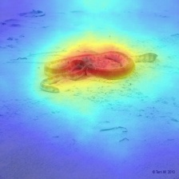
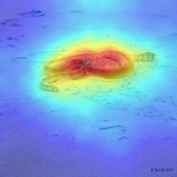
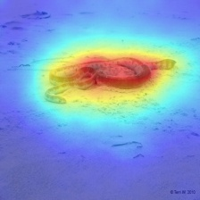
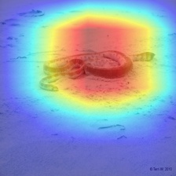
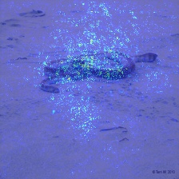
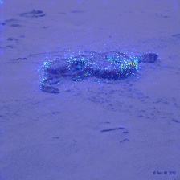

# Full-Gradient Saliency Maps 

This is the reference implementation of the FullGrad saliency method described in our NeurIPS 2019
publication ["Full-Gradient Representation for Neural Network
Visualization"](https://arxiv.org/abs/1905.00780).

This repository implements three methods: 

1) The reference `FullGrad` saliency method, which aggregates layerwise gradient maps multipled with the bias terms
2) `Simple FullGrad`, which omits computation of bias parameters and simply aggregates layerwise gradient maps
3) `Smooth FullGrad`, which aggregates noise averaged layerwise gradient maps with the bias terms  

The related
`full-gradient decomposition` is implemented within `FullGrad`. Note that while `full-gradient
decomposition` applies to any ReLU neural network, `FullGrad` saliency is <b>specific to
CNNs</b>.

In addition, the following methods from literature are also implemented:
1. Input-gradient ([paper](https://arxiv.org/abs/1312.6034))
2. Grad-CAM ([paper](https://arxiv.org/abs/1610.02391))
3. SmoothGrad ([paper](https://arxiv.org/abs/1706.03825))

## Examples
|  |  |  |
|:---:|:---:|:---:| 
| *FullGrad* | *Simple FullGrad* | *Smooth FullGrad* |


|  |  |  |
|:---:|:---:|:---:| 
| *Grad-CAM* | *Input-Gradients* | *SmoothGrad* |


## Usage
Simply run  `python dump_images.py`, the saliency maps should be saved consequently in a results folder.

## Interfaces

The FullGrad class has the following methods implemented.

```python
from saliency.fullGrad import FullGrad

# Initialize FullGrad object
fullgrad = FullGrad(model)

# Check completeness property
# done automatically while initializing object
fullgrad.checkCompleteness()

# Obtain fullgradient decomposition
input_gradient, bias_gradients = 
fullgrad.fullGradientDecompose(input_image, target_class)

# Obtain saliency maps
saliency_map = fullgrad.saliency(input_image, target_class)
```

We also introduce variants called `SimpleFullGrad` and `SmoothFullGrad` 
which have no completeness property or decomposition.

```python
from saliency.simple_fullgrad import SimpleFullGrad
from saliency.smooth_fullgrad import SmoothFullGrad

# Initialize Simple / Smooth FullGrad objects
simple_fullgrad = SimpleFullGrad(model)
smooth_fullgrad = SmoothFullGrad(model)

# Obtain saliency maps
saliency_map_simple = simple_fullgrad.saliency(input_image, target_class)
saliency_map_smooth = smooth_fullgrad.saliency(input_image, target_class)
```

This basic interface is retained for input-gradient, gradcam and smoothgrad methods as well.


## Dependencies
``` 
torch torchvision cv2 numpy 
```

## Research
If you found our work helpful for your research, please do consider citing us.
```
@inproceedings{srinivas2019fullgrad,
    title={Full-Gradient Representation for Neural Network Visualization},
    author={Srinivas, Suraj and Fleuret, François},
    booktitle={Advances in Neural Information Processing Systems (NeurIPS)},
    year={2019}
}
```
